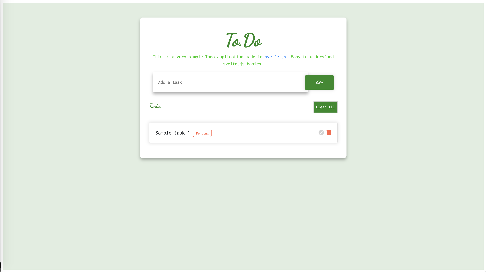

# svelteTodo

svelteTodo is a simple application built with SvelteJS including state management, props and store features of svelte. This is a very easy to understand project if you are working on some JS framework (Vue, React etc.).

 Features of this application:
  - Add a task to the ToDo List.
  - View all tasks added.
  - Mark a task completed.
  - Delete a task.

 ##### Below is a screenshot for the application:
 <p align="center">
  
</p>
 
#### Storage
The application uses browser localstorage to store added tasks.

### Getting Started

svelteTodo requires [Node.js](https://nodejs.org/) to run.

Install the dependencies and start the dev server.

```sh
$ cd svelte-todo
$ npm install
$ npm run dev
```
Then open (http://localhost:5000) to see the application working. And yes now you have a svelte todo application to test and work on.